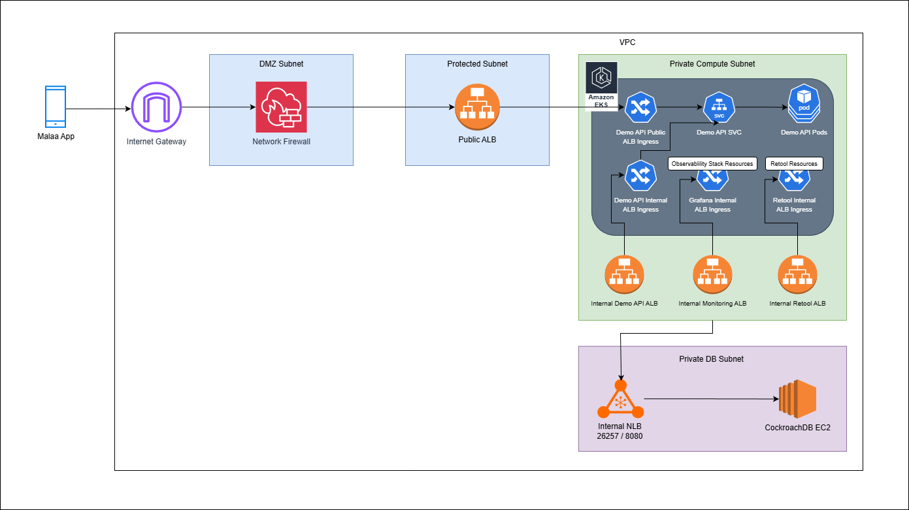

# Introduction
This project aims to deploy a scalable and secure web application infrastructure using Infrastructure as Code (IaC) principles. The infrastructure is defined using Terraform, allowing for easy management and versioning.

# Infrastructure Components
The infrastructure consists of the following key components:
- **Virtual Private Cloud (VPC)**: A logically isolated section of the cloud where resources are deployed.
  - **Public Subnet**: Public subnets to host:
    - Internet-facing Application Load Balancer (ALB)
    - Web Application Firewall (WAF)
    - NAT Gateway
  - **Private Compute Subnet**: Private subnets to host non-internet-facing resources:
    - EKS Cluster
    - Internal Application Load Balancers (ALB)
  - **Private Database Subnet**: Private subnets to host database resources:
    - Inernal Network Load Balancer (NLB)
    - CockroachDB EC2 Instance
  - **Inernet Gateway**: To allow communication between the VPC and the internet.


# Infrastructure Diagram



# Why I Chose This Setup
1. **Scalability**: Using EKS allows for easy scaling of the application based on demand.
2. **Security**: The use of private subnets for sensitive resources like databases enhances security by limiting exposure to the internet.
3. **Load Balancing**: Application Load Balancers distribute incoming traffic efficiently, improving application performance and reliability.
4. **High Availability**: Deploying resources across multiple availability zones ensures high availability and fault tolerance.
5. **WAF Instead of DMZ**: Implementing a Web Application Firewall (WAF) provides robust protection against common web threats, making it a more modern and effective choice compared to traditional DMZ setups, in my opinion.
6. **Internal ALBs for tools**: Using Inernal Application Load Balancers for tools like Grafana and Retool ensures that these monitoring tools are accessible only within the VPC, enhancing security while still providing necessary functionality, allowing us to use VPN or Bastion Host to access them securely.

# Quick Start
To deploy the infrastructure, follow these steps:
1. Ensure you have Terraform installed.
2. make sure your AWS credentials are configured or localstack is set up.
3. Navigate to the `infra` directory.
4. Run the following commands:
```
Terraform init
Terraform apply
```
5. Enter the required variables when prompted.

# Some improvements that can be made
1. **Database Clustering**: Implementing a clustered database setup for CockroachDB to enhance data redundancy and availability.
2. **Automated Backups**: Setting up automated backup solutions for databases to prevent data loss.
3. **CI/CD Integration**: Implementing Continuous Integration and Continuous Deployment (CI/CD) pipelines to automate the deployment process and ensure consistent application delivery.
4. **Use a shared internal ALB for multiple our internal services**: This would reduce the number of ALBs needed and optimize resource usage.


# Conclusion
This was fun.